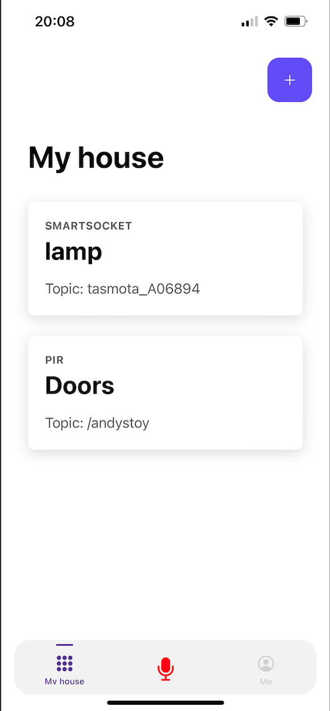
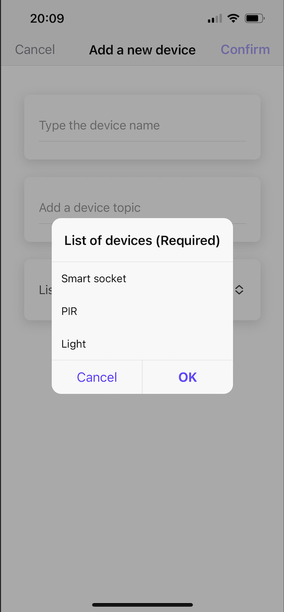
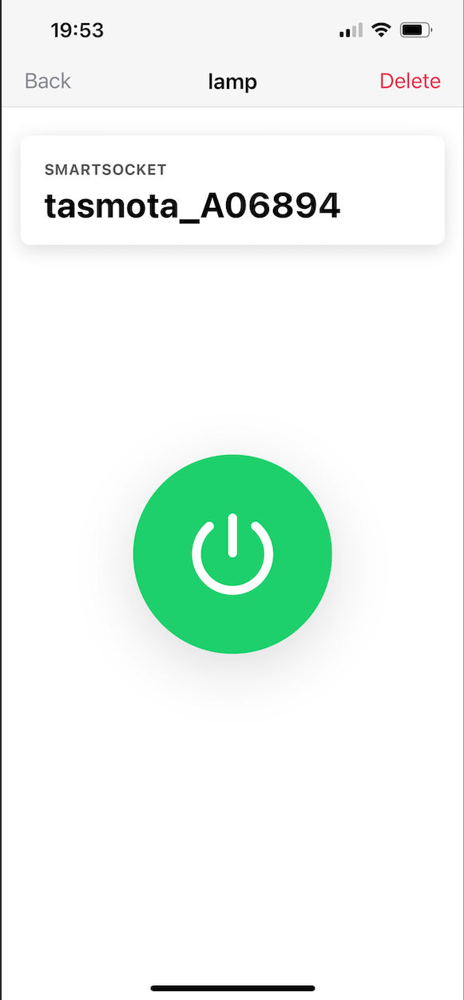
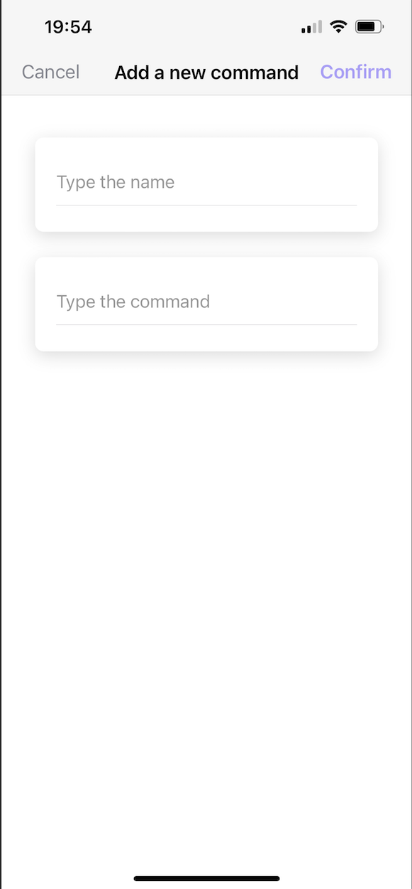
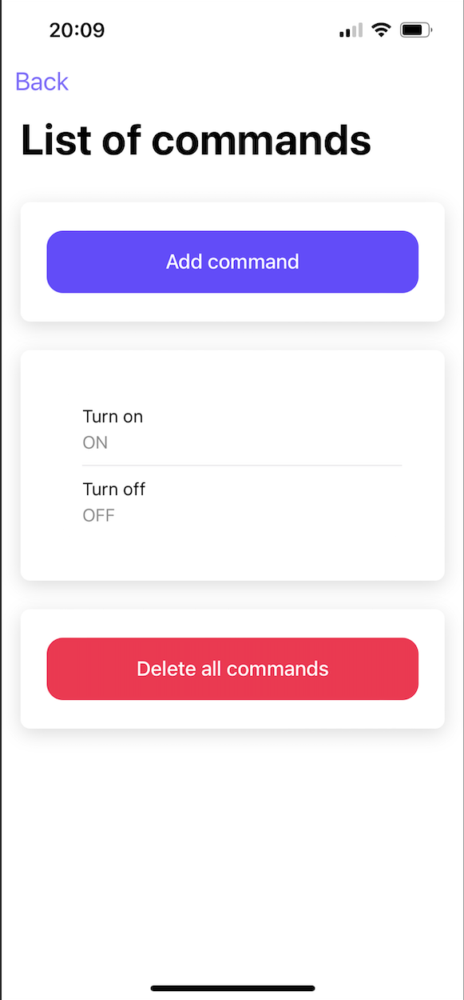
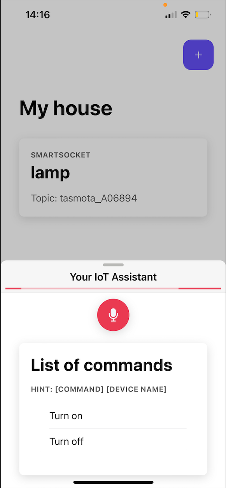

# IoT Device Management Application

## 📌 Overview
This application is designed to efficiently monitor, control, and maintain IoT devices. It provides an intuitive user interface, remote device management.

## 🚀 Features
- 📡 **Device Monitoring** – Track device status and performance in real-time.
- ⚙️ **Remote Management** – Control and configure IoT devices from anywhere.
- 🔐 **Secure Access** – Role-based authentication for enhanced security.

## 🖥️ Screenshots
Here are some previews of the application UI:

### 🔍 Dashboard View  

### 📋 Device Management  

### Command Management

### 🎙️ Voice Command Interface 

## 🛠️ Tech Stack
- **Frontend:** Angular 17 / Ionic 7
- **Backend:** Supabase / MQTT [Cloud Broker](https://cloud.shiftr.io/welcome)
- **Firmware:** Tasmota [firmware](https://tasmota.github.io/docs/About/)
- **Database:** PostgreSQL
- **IoT Communication:** MQTT / WebSockets
- **Voice Recognition:** Speech-to-Text [Plugin](https://github.com/capacitor-community/text-to-speech)